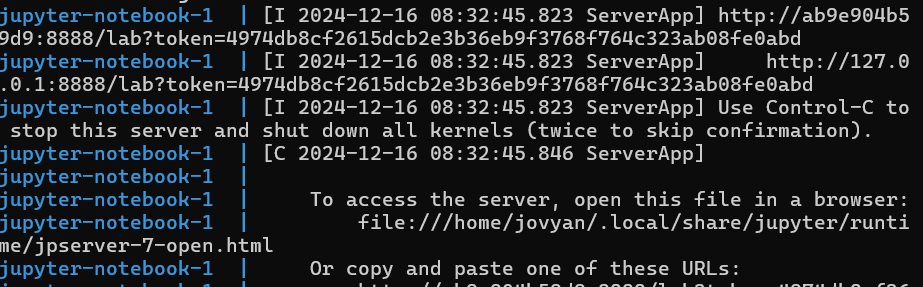

# Heart_Disease_group7

Authors:

-   Alex Wong
-   Caroline Kahare
-   Ethan Fang

## About

The objective of this project is to analyze and model the heart disease dataset to uncover patterns and build a classification model that predicts the presence of heart disease based on key health metrics and attributes. By leveraging data-driven insights, this project aims to contribute to the understanding and early detection of heart disease, which is crucial for effective medical intervention and prevention.

The dataset is multivariate and falls within the domain of health and medicine, with a primary focus on classification tasks. It consists of 303 instances and 13 key attributes, which include both categorical and numerical variables. The target variable, num, indicates the presence or absence of heart disease, with values ranging from 0 (no presence) to 4 (indicating varying levels of severity). The dataset also contains demographic, clinical, and diagnostic attributes, offering a comprehensive view of patient health metrics.

Key features of the dataset include demographic indicators such as age (age in years) and sex (gender: 1 = male, 0 = female). Clinical measurements include trestbps (resting blood pressure), chol (serum cholesterol levels), thalach (maximum heart rate achieved), and oldpeak (ST depression induced by exercise). Additionally, categorical variables such as cp (chest pain type), fbs (fasting blood sugar \> 120 mg/dl), restecg (resting electrocardiographic results), exang (exercise-induced angina), slope (slope of the peak exercise ST segment), ca (number of major vessels colored by fluoroscopy), and thal (heart imaging defects) provide valuable context for predicting heart disease.

The project will begin with data preprocessing, which includes handling missing values in the columns, ca and thal attributes, encoding categorical variables, and scaling numerical features where necessary. Exploratory Data Analysis (EDA) will follow, with visualizations and statistical summaries to identify trends and relationships among variables. For instance, the relationship between cholesterol levels and heart disease prevalence will be examined.

Once the data is prepared, classification models will be developed. The dataset will be split into training and testing subsets to ensure robust evaluation, and performance metrics like accuracy, precision, recall, and F1-score will be used to assess the models. Feature importance analysis will also be conducted to identify the most significant predictors, such as chest pain type (cp), ST depression (oldpeak), and defects in heart imaging (thal).

To improve model performance, hyperparameter tuning will be carried out using techniques such as cross-validation. The final model will be tested on unseen data to ensure it generalizes well. Findings will be summarized in a detailed report or visualized through a dashboard, highlighting clinical implications and actionable insights.

This project aims to develop a reliable classification model for heart disease prediction while identifying key health metrics influencing its presence. It will provide actionable recommendations for early diagnosis and preventive measures. Potential challenges include managing class imbalances, handling missing data, and ensuring the clinical relevance of machine learning results. Addressing these issues effectively will contribute to the success of the project and its impact on healthcare.

## Report

The final report can be found [here](docs/final_report.html)

## Dependencies

-   [Docker](https://www.docker.com/)

-   [VS Code](https://code.visualstudio.com/download)

-   [VS Code Jupyter Extension](https://marketplace.visualstudio.com/items?itemName=ms-toolsai.jupyter)

## Usage

### Setup

-   Clone the repository.

### Running the analysis

1.  Navigate to the root of this project on your computer using the command line and enter 'docker compose up'

2.  In the terminal, look for a URL that starts with `http://127.0.0.1:8888/lab?token=`. Copy and paste that URL into your browser.

    

3.  To run the analysis, Navigate to the root of this project on your computer using the command line and enter the following command to reset the project to a clean state (i.e., remove all files generated by previous runs of the analysis):

    ```         
    make clean
    ```

4.  To run the analysis in its entirety, enter the following command in the terminal in the project root:

``` python
make all
```

### Clean up

-   To shut down the container and clean up the resources, type `Cntrl` + `C` in the terminal where you launched the container, and then type `docker compose rm`

## Developer notes

### Developer dependencies

-   `conda` (version 23.9.0 or higher)

-   `conda-lock` (version 2.5.7 or higher)

### Adding a new dependency

1.  Add the dependency to the `environment.yml` file on a new branch.

2.  Run `conda-lock -k explicit --file environment.yml -p linux-64` to update the `conda-linux-64.lock` file.

3.  Re-build the Docker image locally to ensure it builds and runs properly.

4.  Push the changes to GitHub. A new Docker image will be built and pushed to Docker Hub automatically. It will be tagged with the SHA for the commit that changed the file.

5.  Update the `docker-compose.yml` file on your branch to use the new container image (make sure to update the tag specifically).

6.  Send a pull request to merge the changes into the `main` branch.

## Running the test suite

Use the same `docker compose up` command as described in the above Running the analysis section to launch Jupyter lab. Tests are run using the `pytest` command in the root of the project.

## License

The code of this project licensed under the terms of the MIT license. [MIT License Link](https://opensource.org/license/MIT){.uri}

## References

Janosi, A., Steinbrunn, W., Pfisterer, M., & Detrano, R. (1989). Heart Disease [Dataset]. UCI Machine Learning Repository. <https://doi.org/10.24432/C52P4X>.

Van Rossum, G., & Drake, F. L. (2009). Python 3 reference manual. CreateSpace.

Harris, C. R., Millman, K. J., van der Walt, S. J., Gommers, R., Virtanen, P., Cournapeau, D., Wieser, E., Taylor, J., Berg, S., Smith, N. J., Kern, R., Picus, M., Hoyer, S., van Kerkwijk, M. H., Brett, M., Haldane, A., del Río, J. F., Wiebe, M., Peterson, P., … Oliphant, T. E. (2020). Array programming with NumPy. Nature, 585(7825), 357–362. <https://doi.org/10.1038/s41586-020-2649-2>

VanderPlas, J. (2018). Altair: Interactive statistical visualizations for Python. Journal of Open Source Software, 3(32), 1057. <https://doi.org/10.21105/joss.01057>

Pedregosa, F., Varoquaux, G., Gramfort, A., Michel, V., Thirion, B., Grisel, O., Blondel, M., Prettenhofer, P., Weiss, R., Dubourg, V., Vanderplas, J., Passos, A., Cournapeau, D., Brucher, M., Perrot, M., & Duchesnay, E. (2011). Scikit-learn: Machine learning in Python. Journal of Machine Learning Research, 12, 2825–2830.

McKinney, W. (2012). Pandas: Python data analysis library. In Python for data analysis. O’Reilly Media.
